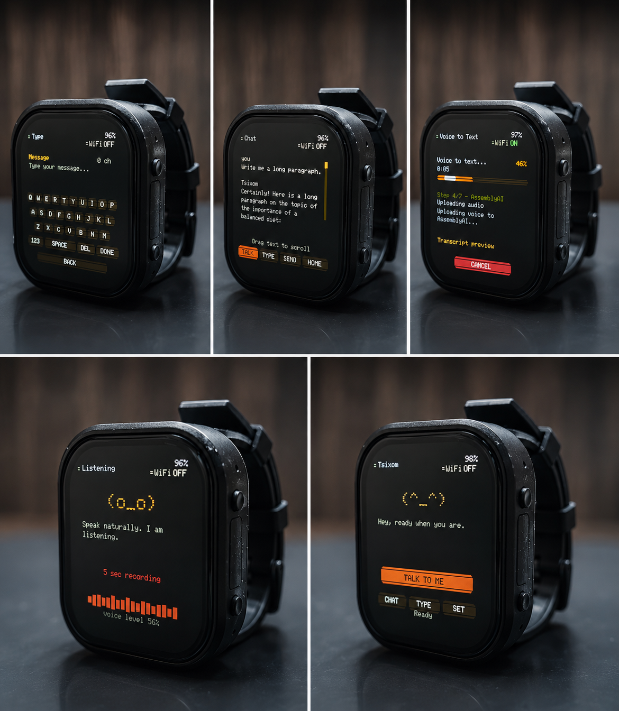
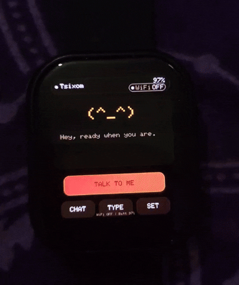

# TsixomAIWatch Buddy v1.0

## Preview

## What It Does
Voice → transcript → AI reply flow

## Key Features
- Custom no-LVGL AMOLED UI
- Voice recording and STT
- Deepgram + AssemblyAI fallback
- OpenRouter AI chat
- Smart / Fast / Creative model modes
- WiFi setup portal
- 3 saved WiFi networks with fallback
- Full-screen touch keyboard
- Themes and brightness
- Battery saver and screen sleep
- Live progress screen
- Debug and memory tools

## Services Used
OpenRouter, Deepgram, AssemblyAI

## Setup
Libraries, board package, API keys, config portal

## Architecture
Display, audio, network, AI, STT, settings, power

## Limitations
Prototype firmware, needs API keys, internet required for AI/STT

# TsixomAIWatch Buddy v2.0
Premium ESP32-S3 AMOLED AI smartwatch firmware

[Get on Ko-fi https://ko-fi.com/s/7e4864a32d] [Watch Demo] [Features] [Setup Preview]

# Demo
# Animated Clock
 
# Settings
 
# Soft Paper Theme 
 
# AI Feauture
 
# Themes 
 

## How is it different from v1.0?
| Area                  | Earlier Version                                    | Upgraded Version                                                                     |
| --------------------- | -------------------------------------------------- | ---------------------------------------------------
| **Display rendering** | Direct drawing to CO5300 AMOLED - flickering issue | PSRAM canvas/double-buffer style rendering - zero flickering                                            |                                                    |              
| **Brightness**        | Software brightness by scaling RGB colors          | Hardware brightness through CO5300 display                                                                                       command, so theme colors stay stable+increased                                                                                     battery life        |                       |                                                    |     |                       |                                                    |      
| **Clock / time**      | No real clock system shown                         | NTP sync, timezone support, 12/24-hour format,                             |                                                    | saved time backup                     
| **Hardware RTC**      | Not present                                        | PCF85063 RTC support for keeping time across                               |                                                    | sleep/reboot                            
| **Power management**  | Basic screen sleep and WiFi saver                  | Screen sleep, light sleep, deep sleep, auto deep                           |                                                    | sleep, manual sleep actions         
| **Wake behavior**     | BOOT button sleep/wake                             | PWR screen sleep/wake, BOOT back/deep wake,                                |                                                    | triple-tap screen wake after light sleep 
| **Touch system**      | Basic touch debounce / held-touch logic            | More reliable gesture system with tap/swipe                                |                                                    | classification and release timeout       
| **Settings pages**    | Voice, AI, Display, WiFi, Debug, About             | Adds Time and Power settings, plus scrollable                              |                                                    | settings home                          
| **Home screen**       | Buddy/home screen only                             | Buddy face can morph into a large clock view                               |                                                    |
| **Telemetry**         | Battery/heap/WiFi info read directly during UI use | Cached UI telemetry for smoother redraws and less                          |                                                    | stutter                            
| **Debug/About UI**    | About page shows many raw diagnostics              | Cleaner About page, diagnostics moved into Debug                                     

## What You Get on Ko-fi
- Full Arduino source code
- Setup instructions
- Required libraries list
- Configuration guide
- Troubleshooting notes
- Future update access, if you want to offer that

## Supported Hardware
https://www.waveshare.com/wiki/ESP32-S3-Touch-AMOLED-2.06

## Required Cloud Services
OpenRouter, Deepgram, AssemblyAI.

## Important Notes
User need their own API keys.
Internet is required for AI/STT.
This is a developer firmware, not a medical/safety device.

## Buy the Firmware
Wait for update

## License / Usage
Personal use only, no resale, no redistribution.
